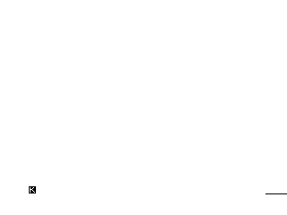

# scrollLeft

Fast left pixel scroll on the ZX81

Uses the same pixel scroll technique as the project pixelScroll.
Take a ZX81 block character, translate it to an 'orable' number
between 0 and 15. Or it with its neighbour, then translate it back
to a block character.

